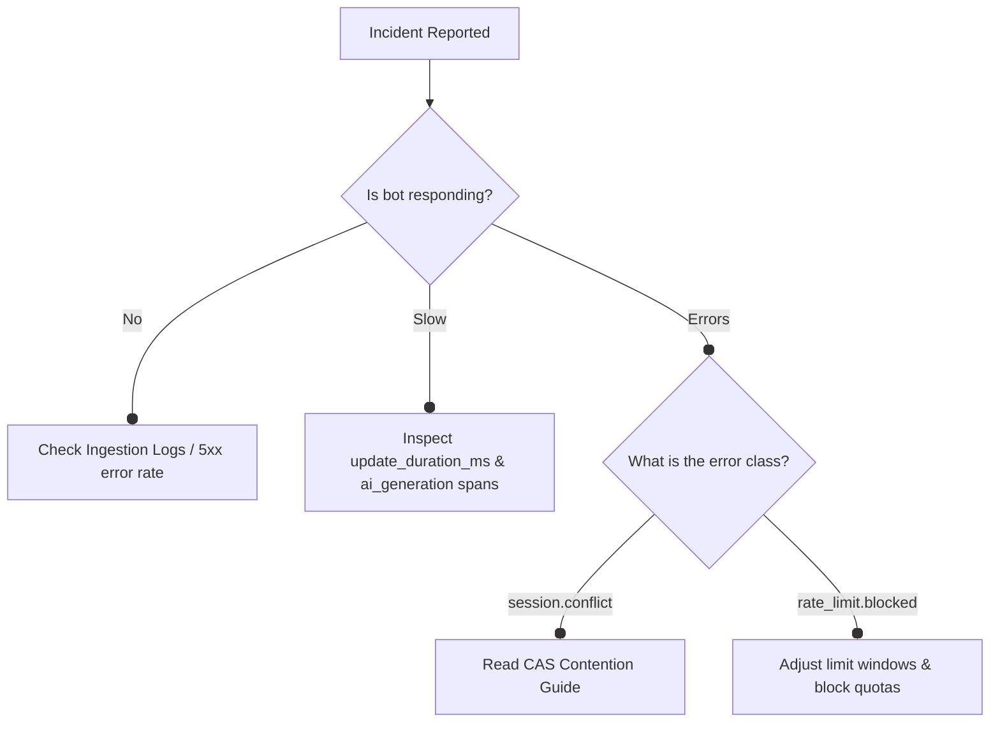

# Incident Debugging Cookbook

This cookbook provides actionable diagnostic pathways and runbooks for addressing performance and error anomalies when running TGWrapper in production.

---

## 🧭 Incident Diagnostic Pathways



---

## 🚨 Incident Playbooks

### Incident 1: Slow Update Ingest Latency / Delayed Replies
* **Symptoms:** Users experience delays of 5s to 30s before receiving bot replies.
* **Telemetry Checklist:**
  1. Inspect `update_duration_ms` histogram. Find the p95 and p99 metrics.
  2. Query traces for the `update_processing` span containing child traces.
* **Diagnostic Actions:**
  - Locate `ai_generation` or database query spans inside the trace timeline.
  - If `ai_generation` spans are long, check for missing execution timeouts/abort signals on LLM endpoints.
  - Check Redis server metrics for connection bottlenecks or high slow queries list.

---

### Incident 2: Duplicate Messages Dispatched to Users
* **Symptoms:** Users receive the same response twice for a single click or tap.
* **Telemetry Checklist:**
  1. Search structured logs for identical `tgwrapper.update_id` values.
  2. Check HTTP status logs on webhook ingestion. Look for non-200 responses.
* **Diagnostic Actions:**
  - If webhook routes return `5xx` or time out, Telegram server retries sending the update. Ensure handlers complete execution well within standard timeouts (e.g., `< 5s`) or hand off tasks to background queues immediately.
  - Verify that the Redis CAS session engine has not been bypassed. If in-memory sessions are used on multi-instance setups, concurrent duplicate webhooks will run side-by-side without contention protection.

---

### Incident 3: Lost Telemetry Context (Blank Trace IDs)
* **Symptoms:** Log logs show `traceId: ""` or fail to output matching correlation tokens for database calls.
* **Telemetry Checklist:**
  1. Check if asynchronous boundaries bypass context hooks.
* **Diagnostic Actions:**
  - Check code executing outside default middleware loops (e.g., using `setTimeout` or raw callbacks). Context propagation requires executing callbacks inside `Tracer.withSpan` wrapper boundaries:
    ```typescript
    import { tracer } from '@tgwrapper/observability';

    // Lost Context:
    setTimeout(() => { doAsyncTask(); }, 1000);

    // Preserved Context:
    setTimeout(() => {
      tracer.withSpan('background_task', () => { doAsyncTask(); });
    }, 1000);
    ```

---

### AI Incident 4: Context Overgrowth
* **Symptoms:** LLM calls fail with `context_length_exceeded`; `ai.prompt_tokens` grows unbounded across turns.
* **Telemetry Checklist:**
  1. Inspect `ai.prompt_tokens` on the `ai_generation` span — flag if > 80% of model's window.
  2. Inspect session state stored in Redis — large tool-call transcripts accumulate silently.
* **Diagnostic Actions:**
  - Apply sliding window on conversation history (keep last N turns).
  - Summarize prior turns with a cheap model call before main generation.

---

### AI Incident 5: Cost Spike
* **Symptoms:** Provider billing dashboard shows unexpected surge; no corresponding increase in user activity.
* **Telemetry Checklist:**
  1. Check `ai.total_tokens` per-conversation in traces — identify outlier conversations.
  2. Look for unbounded retry loops: a tool returning an error may re-trigger generation without a retry cap.
* **Diagnostic Actions:**
  - Set `maxRetries: 2` on AI step loops.
  - Add a per-conversation token budget cap. If spike is live: disable AI via feature flag immediately.

---

### AI Incident 6: Wrong Tool Sequence
* **Symptoms:** Bot calls tools in unexpected order; traces show tool spans out of expected dependency order.
* **Telemetry Checklist:**
  1. Pull the full `tool_call` span sequence from the trace for the affected update.
  2. Compare against expected tool graph in the system prompt.
* **Diagnostic Actions:**
  - Add precondition guards before each tool step.
  - Reduce model temperature or add explicit ordering instructions to the system prompt.
  - Log `tool_call_sequence` as a span attribute for future auditability.

---

### AI Incident 7: Partial Response Generation
* **Symptoms:** Bot message ends mid-sentence; LLM response shows `finish_reason: "length"`.
* **Telemetry Checklist:**
  1. Check `ai.completion_tokens` vs. configured `max_tokens` — if equal, the response was cut.
* **Diagnostic Actions:**
  - Increase `max_tokens` or restructure prompt to produce shorter outputs.
  - Detect and handle gracefully:
    ```typescript
    if (response.finishReason === 'length') {
      await bot.sendMessage(chatId, '[Response was cut off. Please rephrase with a shorter question.]');
    }
    ```
  - Alert on `finish_reason == 'length'` rate > 5% of completions.

---

### AI Incident 8: Model Timeout
* **Symptoms:** `ai_generation` span ends with `error: timeout` or `AbortError`; user receives no reply.
* **Diagnostic Actions:**
  - Verify all LLM calls are wrapped with an `AbortSignal` timeout (≤ 10s recommended).
  - Return a fallback message immediately on abort; do not leave the update unacknowledged.

---

### AI Incident 9: Tool Call Hang
* **Symptoms:** `update_processing` span extends past 15s; tool child spans show no end timestamp.
* **Diagnostic Actions:**
  - Wrap all tool calls in a timeout guard.
  - Implement circuit breaker: after N consecutive failures, disable the tool and fall back to pure language generation.

