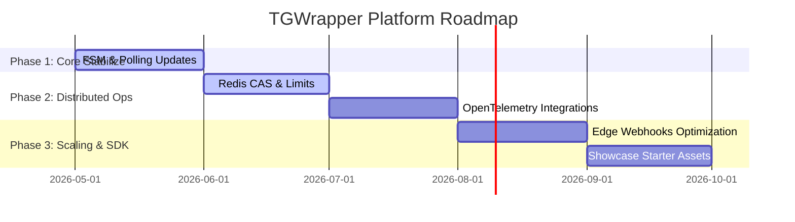

# TGWrapper Public Roadmap

This document outlines the development phases, goals, and targets for the TGWrapper Telegram platform.

---

## 🗺️ Roadmap Phases

---

## 🎯 Development Priorities

### Phase 1: Core Stabilize (Current Focus)
- Validate 100% test coverage boundaries.
- Track Telegram Bot API schema drift automatically.
- Maintain dual ESM/CommonJS distribution.

### Phase 2: Distributed Operations
- Improve Redis CAS performance under contention.
- Refine span nesting and propagation scopes.
- Standardize `/metrics` endpoint exports.

### Phase 3: Scaling & SDK
- Expand documentation and migration guides for other language ecosystems (e.g. Python, Go).
- Establish early adopter user groups and community channels.
