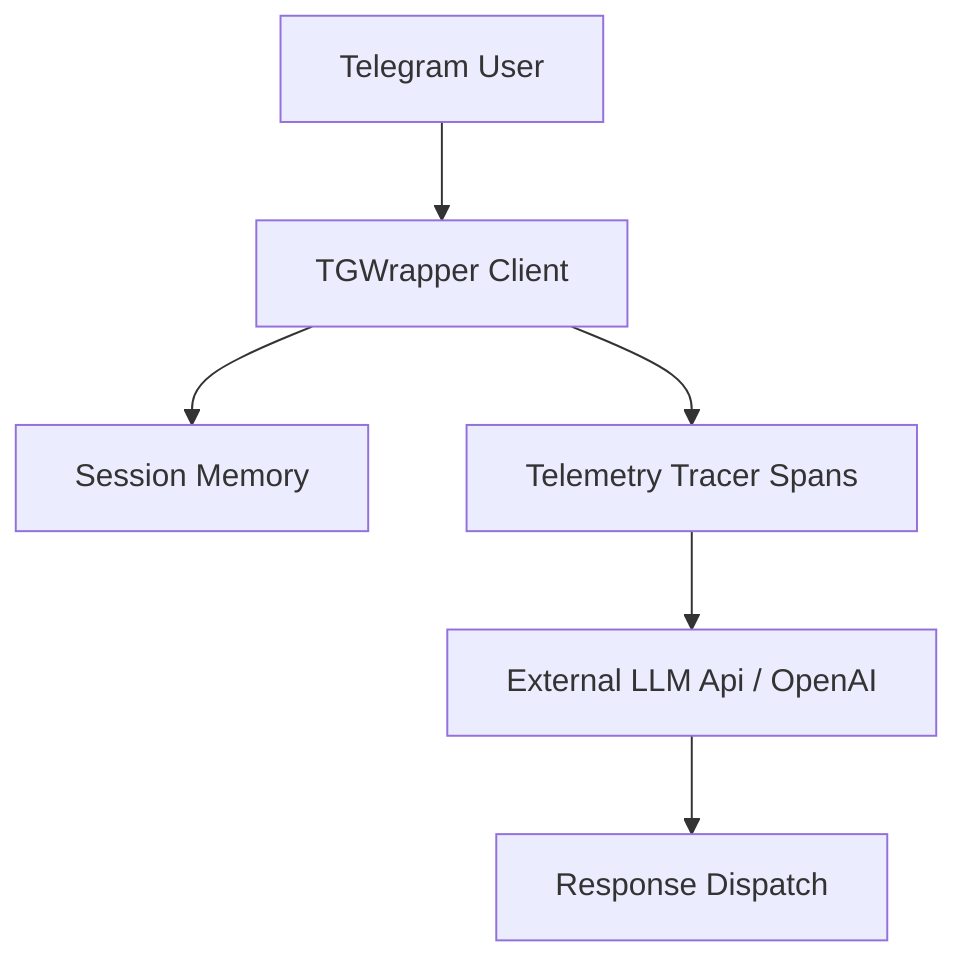

# TGWrapper AI Bot Starter

A reference implementation demonstrating how to build **AI-native Telegram bots** using TGWrapper. Integrates conversational interfaces, FSM state management, and telemetry traces for LLM interactions.

---

## 🏗️ Architecture

AI assistants require tracking multi-step conversations and third-party model latencies:



---

## 🛠️ Getting Started

### 1. Configuration
Provide API credentials:
```env
BOT_TOKEN="123456789:ABCdefGhIJKlmNoPQRsTUVwxyZ"
OPENAI_API_KEY="sk-proj-..."
```

### 2. Local Execution
```bash
# Install dependencies
pnpm install

# Start the bot
pnpm start
```

---

## 🛡️ Production Tracing & AI Observability

For production AI bots, you should instrument the LLM spans to monitor token usage and response latencies:

1. **Attach Tracer:** Import the tracer from `@jilimb0/tgwrapper-observability`.
2. **Nest Spans:** Wrap model invocations inside logical span frames.
3. **Log Usage:** Save prompt and completion token counts into span metrics tags.

*For exact metrics exporter recipes, see [Observability Telemetry Documentation](../../packages/observability/README.md).*
