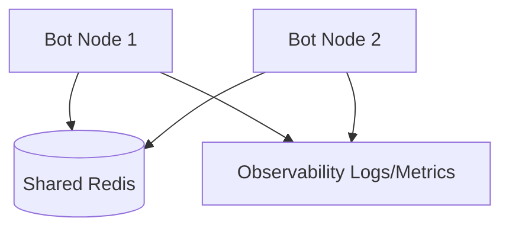

# TGWrapper Multi-Instance Redis Starter

A complete, high-fidelity production-ready template demonstrating the integration of `@jilimb0/tgwrapper` (core), `@jilimb0/tgwrapper-adapter-redis`, and `@jilimb0/tgwrapper-observability`.

---

## 🏗️ Architecture



---

## 🛠️ Getting Started

### 1. Requirements
Ensure you have a running Redis instance (e.g. `redis://localhost:6379`). You can start Redis quickly using Docker:
```bash
docker run --name bot-redis -p 6379:6379 -d redis
```

### 2. Configuration
Setup environment:
```env
BOT_TOKEN="your_bot_token"
REDIS_URL="redis://localhost:6379"
```

### 3. Execution
```bash
# Install dependencies
pnpm install

# Start the bot runner
pnpm start
```
---

## 🔍 Features Demonstrated
1. **Distributed Rate Limiting:** Lua-based sliding window rate limiter protects nodes from flood spikes.
2. **Versioned Sessions:** Safe state management avoiding session overwrite collision.
3. **Observability Integration:** Emits structured JSON events when launches, updates, or errors occur.
