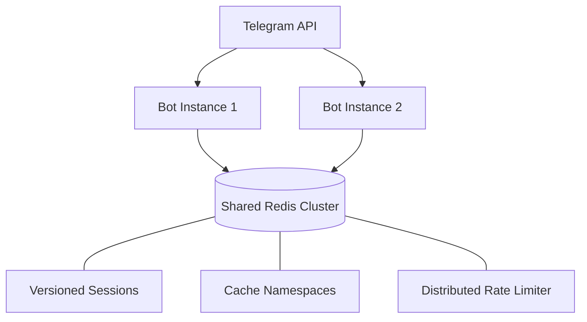

# @jilimb0/tgwrapper-adapter-redis

> Production runtime foundation for TGWrapper providing distributed sessions, caching namespaces, and a high-performance distributed rate limiter.

## 📦 Installation

```bash
pnpm add @jilimb0/tgwrapper-adapter-redis ioredis
```

---

## 🏗️ Production Architecture

In serverless (AWS Lambda, Cloudflare Workers) or multi-instance load-balanced environments, in-memory state is transient. `@jilimb0/tgwrapper-adapter-redis` provides the persistent glue required to coordinate multiple concurrent bot instances:



---

## 🛠️ Capabilities & API Overview

### 1. Distributed Versioned Sessions (`RedisSessionAdapter`)
Features optimistic concurrency control via Compare-and-Swap (CAS) to prevent race conditions when multiple updates modify the same user session concurrently.

```typescript
import { RedisSessionAdapter } from '@jilimb0/tgwrapper-adapter-redis';

const sessionAdapter = new RedisSessionAdapter({
  redisUrl: process.env.REDIS_URL!,
  tenantId: 'tenant_abc',
  botId: 'my_production_bot',
  ttlSeconds: 86400 // Automatically expire sessions after 24h
});

// Load session
const key = 'user:12345';
const session = await sessionAdapter.get(key);

// Atomic write (Compare and Set)
if (session) {
  const result = await sessionAdapter.compareAndSet(key, session.version, {
    ...session,
    version: session.version + 1,
    state: 'awaiting_feedback'
  });
  
  if (!result.ok) {
    console.warn('Concurrency conflict! Stale version detected. Current database state:', result.current);
  }
}
```

---

### 2. Cache Namespacing (`RedisKvStore` & `RedisCacheStore`)
Organize temporary data into isolated namespaces with distinct TTL lifetimes and keys matching strategies.

```typescript
import { RedisKvStore } from '@jilimb0/tgwrapper-adapter-redis';

const store = new RedisKvStore({
  redisUrl: process.env.REDIS_URL!,
  prefix: 'bot:cache'
});

// Create cache namespace
const cache = store.createCacheNamespace('user_profiles');

// Caching JSON payloads
await cache.setJson('profile:123', { name: 'Alice', role: 'admin' }, 3600);
const profile = await cache.getJson<{ name: string }>('profile:123');

// Index support for bulk invalidation
await cache.index.upsert('admins', 'profile:123');
const admins = await cache.index.members('admins'); // ['profile:123']
```

---

### 3. Distributed Sliding-Window Rate Limiter (`RedisRateLimiter`)
Protects your bot from flood spikes. Uses a Lua script to evaluate limits atomically in a single Redis roundtrip without race conditions.

```typescript
import { RedisKvStore, createRateLimiter } from '@jilimb0/tgwrapper-adapter-redis';

const kv = new RedisKvStore({ redisUrl: process.env.REDIS_URL! });

const limiter = createRateLimiter(kv, {
  namespace: 'chat_limit',
  windowMs: 10_000,      // 10 second window
  limit: 5,             // Max 5 messages
  blockDurationMs: 60_000 // Block for 1 minute if exceeded
});

const res = await limiter.check('chat:987654');

if (!res.allowed) {
  console.log(`Rate limited! Retry in ${res.retryAfter} seconds. Reset at ${new Date(res.resetAt).toLocaleTimeString()}`);
} else {
  console.log(`Allowed. Remaining quota: ${res.remaining}`);
}
```

---

## ⚡ Failure Semantics & Resilience

When operating Redis in production, you must design for transient failures. The Redis adapter defines the following behaviors:

### 1. Reconnect Storms & Connection Timeout
- The adapter instantiates `ioredis` with `lazyConnect: false` and `maxRetriesPerRequest: 1` by default.
- This prevents your serverless functions from hanging indefinitely during a network partition.
- If Redis is unavailable, methods immediately throw an error, allowing the bot's runtime error boundaries (Observability hooks) to catch and log the failure.

### 2. Session Optimistic Lock Collisions
- During high concurrent update processing (e.g., a user spamming buttons), `compareAndSet` evaluates version numbers.
- If a conflict occurs, `compareAndSet` returns `{ ok: false, current: { value, version } }`.
- **Recommended Action:** Catch conflict events, merge the state changes programmatically, and retry the update.

### 3. Rate Limiter Script Safety
- The limiter evaluates limits using Lua script `RATE_LIMITER_SCRIPT` which handles sorted sets (`ZADD`, `ZCARD`, `ZREMRANGEBYSCORE`).
- If Redis memory limits (`maxmemory`) are hit, the Lua script may fail. Make sure your Redis instance uses an eviction policy like `volatile-lru` or `allkeys-lru`.

---

## 📈 Performance & Operational Notes

- **Key Prefix Architecture:** Keys are organized hierarchically to simplify administrative tasks like scanning and flushing:
  - Sessions: `framework:{tenantId}:{botId}:session:{key}`
  - Generic Cache: `framework:kv:{namespace}:{key}`
- **TTL Strategy:** Always define a TTL for session and cache namespace keys. Un-expiring keys in high-traffic bots will lead to memory bloat over time.
- **Connection Optimization:** Ensure that in Serverless (AWS Lambda / Cloudflare Workers) setups, you call `.disconnect()` at the end of the handler run, or configure connection pooling appropriately if runtimes support connection reuse.
